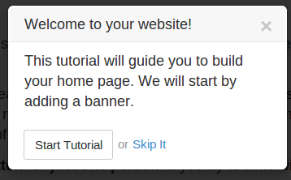
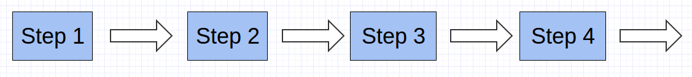
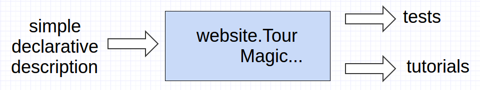

How to develop automated tests
===============================

Géry Debongnie

Content
---------

1. Automated tests
2. website.tour.js
3. Case study 
4. Testing in practice

Automated Tests
==================
Tour = Test or Tutorial

A Short Demo
-------------

    

Tutorials and Tests
-------------------

* **tutorials** : sequence of steps.  Each step wait for the user to do something, before moving to the next step.

* **tests** : same, but the js code simulates an user 

Use Cases
----------

* guide your users with tutorials
* test any kind of business flow (customer buying an event ticket, ...)
* test any odoo addon (application in backend) (not ready yet)

website.tour.js
==================

Architecture
-------------

* manage all tours (tests/tutorials)
* standalone (doesn't use odoo framework)
* save its state in local storage (survive a refresh/page change)
* simulates all DOM events
* automatically adds tutorials in the help menu
* tests will only be successful if all steps are completed

Simple example (test)
----------------------

.. code-block:: javascript

    website.Tour.register({
        id:   'shop_customize',
        name: "Customize the page and search a product",
        path: '/shop',
        mode: 'test',
        steps: [
            {
                title:     "open customize menu",
                element:   '#customize-menu-button',
            },
            {
                title:     "click on 'Product Attribute's Filters'",
                element:   "#customize-menu a:contains(Product Attribute's Filters)",
            },
            {
                title:     "select product attribute memory 16 Go",
                element:   'form.js_attributes label:contains(16 Go) input:not(:checked)',
            },
            ...
        ]
    });

API
-----
A tour is defined by some simple attributes:

* id
* name
* path
* mode

.. code-block:: javascript

    id:   'shop_customize',
    name: "Customize the page and search a product",
    path: '/shop',
    mode: 'test',

and a more complex one: steps.

Steps definition
-------------------

A step is defined with a selection of attributes:

* title
* element
* waitFor
* waitNot
* some others

.. code-block:: javascript

    {
        title:     "open customize menu",
        element:   '#customize-menu-button',
    },
    {
        title:     "click on 'Product Attribute's Filters'",
        element:   "#customize-menu a:contains(Product Attribute's Filters)",
    },

Steps definition (2)
----------------------

.. code-block:: javascript

    {
        title:     "select product attribute memory 16 Go",
        element:   'form.js_attributes label:contains(16 Go) 
                                        input:not(:checked)',
    },
    {
        title:     "check the selection",
        waitFor:   'form.js_attributes label:contains(16 Go) input:checked',
    },
    {
        title:     "select ipod",
        waitNot:   '.oe_website_sale .oe_product_cart:eq(2)',
        element:   '.oe_product_cart a:contains("iPod")',
    },
    {
        title:     "finish",
        waitFor:   'label:contains(32 Go) input',
    }

Tests: automated actions!
-------------------------

Actions are simulated on the 'element':

* mouseenter, mousedown, mouse click, mouse up, mouse leave
* if attribute sampleText: idem, then keydown, 
    * if input/select, value is set to sampleText
    * otherwise, html is set to sampleText
* if snippet: simulates drag and drop with mousedown, mousemove,mouseup

.. code-block:: javascript

    {
        title:     "set one iPod",
        waitNot:   '#cart_products tr:contains("Apple In-Ear Headphones")',
        element:   '#cart_products input.js_quantity',
        sampleText: '1',
    },

Case study
===========
a more complex example (tutorial)

Create a product
-----------------

.. code-block:: javascript

    website.Tour.register({
        id: 'shop',
        name: _t("Create a product"),
        steps: [
            {
                title:     _t("Welcome to your shop"),
                content:   _t("You successfully installed the e-commerce. This guide will help you to create your product and promote your sales."),
                popover:   { next: _t("Start Tutorial"), end: _t("Skip It") },
            },
            {
                element:   '#content-menu-button',
                placement: 'left',
                title:     _t("Create your first product"),
                content:   _t("Click here to add a new product."),
                popover:   { fixed: true },
            },
            ...

.. nextslide::
   :increment:

.. code-block:: javascript

        {
            element:   'a[data-action=new_product]',
            placement: 'left',
            title:     _t("Create a new product"),
            content:   _t("Select 'New Product' to create it and manage its properties to boost your sales."),
            popover:   { fixed: true },
        }, {
            element:   '.modal #editor_new_product input[type=text]',
            sampleText: 'New Product',
            placement: 'right',
            title:     _t("Choose name"),
            content:   _t("Enter a name for your new product then click 'Continue'."),
        }, {
            waitNot:   '.modal input[type=text]:not([value!=""])',
            element:   '.modal button.btn-primary',
            placement: 'right',
            title:     _t("Create Product"),
            content:   _t("Click <em>Continue</em> to create the product."),
        },

It's really easy!
-----------------

Just follow the examples...

* website.tour.events.js
* website.tour.blog.js
* ...

Testing in practice
====================

Testing with the runbot
-------------------------

Example: test_sale_process.py

.. code-block:: python

    inject = [
        ("openerp.website.Tour", '.../static/src/js/website.tour.js')),
        ("openerp.website.Tour.ShopTest", '.../src/js/website.tour.sale.js"))]

    class TestUi(openerp.tests.HttpCase):
        def test_01_admin_shop_tour(self):
            self.phantom_js(
                "/", 
                "openerp.website.Tour.run('shop', 'test')", 
                "openerp.website.Tour.tours.shop", login="admin")

        def test_02_admin_checkout(self):
            self.phantom_js(
                "/", 
                "openerp.website.Tour.run('shop_customize', 'test')",
                "openerp.website.Tour.tours.shop_customize",
                login="admin", 
                inject=inject)

Coming Soon (really)
---------------------

* testing in backend
* file upload 

Thank you
==========