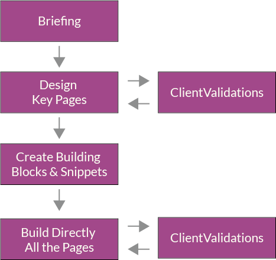

Create Themes for Website
=========================

By Fabien Pinckaers - Founder & CEO, Odoo

Topics
------

1. Introduction
	* Classical workflow
	* Odoo's CMS workflow
2. Tutorial
	* Starting with a single page
	* Snippets
	* Options
	* Custom Css
3. Examples

Introduction
============

Classical workflow
------------------

Start a new project.

.. image:: images/illus1.png   
   :width: 70%
   

Working with Odoo CMS
---------------------

Start a new project.

Classical workflow
------------------

Add new features or pages.

.. image:: images/illus1_1.png   
   :width: 70%
   

Working with Odoo CMS
---------------------

Add new features or pages.

.. image:: images/illus2_1.png   
   :width: 70%

Tutorial
========

A Theme?
--------

| 
| 
| 
| 
| 

.. centered:: A Theme is an Odoo's MODULE

(Without Python Logic)

Structure of a Theme
--------------------

* My Theme
	* static
  		* src
			* js, css, font, xml, img
	* views
		* my_theme.xml 
		* snippets.xml
		* options.xml
		* pages.xml (static pages)
		* [...]
    
Simple HTML page
================

Starting with an HTML page
--------------------------

Let's start with the homepage.

*views/pages.xml*
	
.. literalinclude:: code/1.xml
   :language: xml
   :linenos:

Starting with an HTML page
--------------------------

Add the Odoo context :
( with Bootstrap front-end framework, Edition bar, Snippets, etc. )

*views/pages.xml*
	
.. literalinclude:: code/2.xml
   :language: xml
   :linenos:

Starting with an HTML page
--------------------------

It's possible to create all the pages like this way.

*views/pages.xml*

.. literalinclude:: code/3.xml
   :language: xml
   :linenos:

Adding the class "oe_structure" allows you to use this cool feature: **Snippets**.

Snippets
========

Build with snippets
-------------------

But instead of creating all the pages this way, 
we think about using "Building Blocks".

We call them "**Snippets**".

- Block of html code usable everywhere.
- Draggable in your page.
- Can contain Javascript or/and Css logics.

.. slide:: 
   :class: fullscreen
   :inline-contents: True
   
   .. figure:: images/ii1.png
      :class: fill

.. slide:: 
   :class: fullscreen
   :inline-contents: True
   
   .. figure:: images/ii2.png
      :class: fill

A very Simple Snippet
----------------------

Structure of a snippet.

*views/snippets.xml*

.. literalinclude:: code/5.xml
   :language: xml
   :linenos:

Customize my Snippet
--------------------

We can customize this simple snippet with Sass/Css.

*static/src/css/my_theme.sass*

.. literalinclude:: code/7.xml
   :language: sass
   :linenos:

*static/src/css/my_theme-snippet.sass*

.. literalinclude:: code/8.xml
   :language: sass
   :linenos:

Customize my Snippet
--------------------

To insert this new Css we need to extend the theme template and replace the default bootstrap by our new Css.

*views/my_theme.xml*

.. literalinclude:: code/9.xml
   :language: xml
   :linenos:

Snippet & Javascript
--------------------

It's possible to add **javascript logic** when a snippet has been dropped or appears in the page.

*static/src/js/snippet.js*

.. literalinclude:: code/10.xml
   :language: javascript
   :linenos:

Snippet & Javascript
--------------------

Just inherits from "website.assets_frontend" template to enable it.

*views/my_theme.xml*

.. literalinclude:: code/10_a.xml
   :language: xml
   :linenos:

Organize my snippets
--------------------

You can create a new snippet section or insert your snippet into an already present section.

New section
*views/snippet.xml*

.. literalinclude:: code/4.xml
   :language: xml
   :linenos:

Insert into "Structure" section.

.. literalinclude:: code/4_a.xml
   :language: xml
   :linenos:

Options
=======

Add Options
-----------

We can add options for every snippets or blocks.

In our case, we add 2 options ( patterns background) for the snippet created before.

*views/options.xml*

.. literalinclude:: code/11.xml
   :language: xml
   :linenos:

Add Options
-----------

In fact, it adds a class-name to the data-selector.

And now, simply create the Css to have the desired result.

*static/src/css/my_theme-options.sass*

.. literalinclude:: code/12.xml
   :language: sass
   :linenos:

Custom Css
-----------

We can override `Bootstrap variables <https://github.com/twbs/bootstrap-sass/blob/master/vendor/assets/stylesheets/bootstrap/_variables.scss>`_ to create your theme.
 
*static/src/css/my_theme.sass*

.. literalinclude:: code/13.xml
   :language: sass
   :linenos:

Summary
=======

Summary
-------

* Infinite customizations
* Easy to understand
* Template inherits
* Bootstrap based
* Only imagination is your limit
* Robust Odoo back-end behind

**... and so much things will come  :)**

Example
=======

.. slide:: 
   :class: fullscreen
   :inline-contents: True
   
   .. figure:: images/zen.png
      :class: fill

.. slide:: 
   :class: fullscreen
   :inline-contents: True
   
   .. figure:: images/gourmand.png
      :class: fill

.. slide:: 
   :class: fullscreen
   :inline-contents: True
   
   .. figure:: images/odoo.png
      :class: fill

Thank you
=========

And we are hiring a webdesigner. 
Contact cde@odoo.com for more informations.
