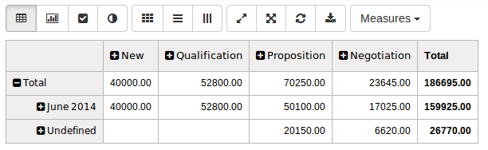
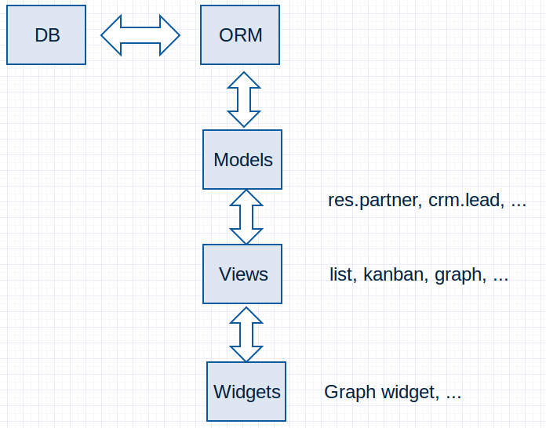
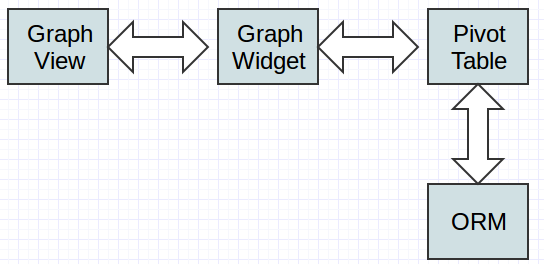
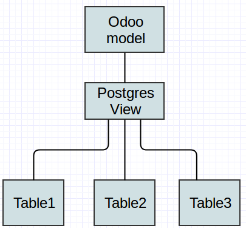

Business Intelligence
=======================

Develop cube views
for your own objects

.. Géry Debongnie

Content
----------------

1. BI/Graph View
2. Technical Overview
3. Preparing Data
4. Displaying cube views
5. Case study: cross models
6. Conclusion

BI/Graph View
===============

BI/Graph View
--------------

* measure : can be aggregated (right now, only summed)
* dimension : can be grouped

.. note::
    multidimensional analysis

    aggregated function is right now only sum

    here, measure planned_revenue
    dimensions: stage and expected closing

A  Short History of BI in Odoo
------------------------------

* pre 2014: list view + group bys, graph view
* Q1/Q2 2014: graph view rewrite -> pivot table + graphs, lots of backend work 
* future: ? we're looking at searchview/BI view integration.

.. note::
    not much to say

    rewrite with nvd3

    backend work: readgroup optimize, ...

    bi view is still called graph view in code. in this talk, i will use
    both terms 

Technical Overview
====================

Odoo architecture
-------------------------------

.. note::
    big picture view first

Anatomy of BI/Graph View 
--------------------------

* **pivot table**: keeps the data, calls the ORM

* **graph widget** : user interaction

* **graph view** : client interaction

.. note::
    graph view  basically only instantiate a graph widget, and 
    makes the link between the search view and the widget, both ways

.. note::
    searchview/ filters/group by

BI view xml
--------------

.. code-block:: xml

    <record id="..." model="ir.ui.view">
        <field name="name">crm.opportunity.report.graph</field>
        <field name="model">crm.lead.report</field>
        <field name="arch" type="xml">
            <graph string="Leads Analysis" type="pivot" stacked="True">
                <field name="date_deadline" type="row"/>
                <field name="stage_id" type="col"/>
                <field name="planned_revenue" type="measure"/>
            </graph>
        </field>
    </record>

BI view API
------------

In *graph* tag:

* string: title
* stacked: if bar chart is stacked/not stacked (default=false)
* type: mode (pivot, bar, pie, line) (default=bar)

-------

In *field* tags, *type* attribute:

* row : will be grouped by rows (dimension)
* col : will be grouped by cols (dimension)
* measure : will be aggregated
* if no type, measure by default

.. note::
    these parameters only indicate the view opened by default,
    some can be overrided by filters

    old syntax supported (operator = +)

    those options will be parsed by graph view and sent to the 
    graph widget

Date/datetime
----------------

Always want to be different: date/datetime have a special syntax for groupby:

* field_date:day, 
* field_date:week, 
* field_date:month (default)
* field_date:quarter, 
* field_date:year

.. code-block:: xml

        <graph string="Leads Analysis" type="pivot" stacked="True">
            <field name="date_deadline:week" type="row"/>
            <field name="stage_id" type="col"/>
            <field name="planned_revenue" type="measure"/>
        </graph>

.. note::
    just field_date will work

Graph widget setup
-------------------

Graph widget has two more options:

* *visible_ui* (true) : indicate if UI is visible
* *heatmap_mode* ('none') can be set to row/col/both

.. note::
    BI view will change, but this api should kind of stay stable

    more options could be added 

    right now, as far as I know, it has not yet been used as a standalone
    widget, but it could.

Preparing Data
====================

.. note::
    Data is central

Odoo Model
-----------

Odoo BI view will read the various fields. Depending on their type, it will use them for

* measures : every fields of type *integer*, *float* (except 'id')
* dimensions : 
    * right now: every fields defined in the 'group by' category in the search bar.
    * later: every field that can be grouped by the db

.. note::
    for measure: except the 'id' field

    warning: date as date/datetime, not string

    but later, this will be pretty much every non numeric fields 

Where is your data?
--------------------
The data needs to satisfy two conditions:

* be stored in the database (beware of functional fields not stored)
* be accessed from one single odoo model

------

.. note::
    need to be stored in the db because it is aggregated through it
    (postgres)

If yes, you're done.
If not, two possibilities:

* can you extend a model? (stored functional fields, relational fields)
* can you create a custom model with a postgres view, to link the various models with the data?

.. .. image:: images/choices2.png
..     :align: center
..     :width: 100%

------

Bottom line: it needs to be in the DB

.. note::

    the data need to be extracted from two or more models with various relationships => add a custom postgres view. all reporting views
    are doing exactly that

    2. the data can be obtained/derived in a single Odoo model => extend the model by adding functional field/one2many field/... (not aggregating... unless it's average... data should be just data, not make computations)

.. note::
    for example, you might want to compute the total amount invoiced to
    a customer.  can't be done by the BI view right now

Extending a model
------------------

WARNING: old API... Do not try this at home!!!

.. code-block:: python

    class res_partner(osv.osv):
        _name = 'res.partner'
        _inherit = 'res.partner'

        def _total_invoice(self, cr, uid, ids, ...):
            ...
            # [insert here nice looking code to
            # compute the total invoice of a customer]
            ...
            return result

        _columns = {
            'total_invoiced': fields.function(_total_invoice, 
                    string="Total Invoiced", type='float', store=True)
            }

.. code::
    second warning: untested code!! this is just a proof of concept
    to illustrate the point

    emphasize that store=true is required, otherwise it will not work

.. give code example

More advanced: Cross model analysis
------------------------------------

Example: purchase/report/purchase_report.py

All reporting views use that technique.  Warning: bypass the ORM

.. note::
    wanted to give a nice example, but not enough time for example
    that has functional sense and really simple

    explain that the data is not different, it is still in the original
    table. 

    look at reporting for examples

    warning: only use this for viewing data, can't edit it.

    

Displaying cube views
=========================

.. note::
    now, the question is how to display that nice data?
    3 ways to do that

Edit in live
---------------------

1. go to developer mode
2. edit action, add 'graph',
3. edit views, create 'graph' 
4. profit!

.. note::
    just add some xml if you can be in developer mode. good for testing

    faire démo: add view to sales team

    * add graph to action
    * show icon, show it doesn't work, no default view
    * add graph view
    * show it works
    * explain why already grouped
    * edit graph view xml to change
    * add invoiced_forecast as a measure

Good for testing.

Adding a BI view with xml
--------------------------

Add the desired graph view:

.. code-block:: xml

        <record id="view_project_task_graph" model="ir.ui.view">
            <field name="name">project.task.graph</field>
            <field name="model">project.task</field>
            <field name="arch" type="xml">
                <graph string="Project Tasks" type="bar">
                    <field name="project_id" type="row"/>
                    <field name="planned_hours" type="measure"/>
                </graph>
            </field>
        </record>

Adding a BI view with xml(2)
-----------------------------

Add it to the action:

.. code-block:: xml

    <record id="action_view_task" model="ir.actions.act_window">
        ...
        <field name="view_mode">kanban,tree,form,calendar,gantt,graph</field>
        ...

You can force the correct view:

.. code-block:: xml

        <field name="view_id" ref="view_project_task_graph"/>

Advanced: client action 
--------------------------------------

In js, create a widget and append it to your view:

.. code-block:: javascript

    this.graph_widget = new openerp.web_graph.Graph(
        this, 
        some_model, 
        some_domain, 
        options);
    this.graph_widget.appendTo(this.$el);

.. note::
    noone did it yet!!!

Future of BI in odoo?
=====================

.. note::
    Open question!

    Perhaps add some other way to group data

    Or other way to aggregate (for example, average or max)

Thank you
============

.. note::
    future of BI in Odoo?
    thank you!