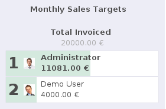
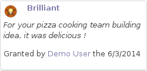
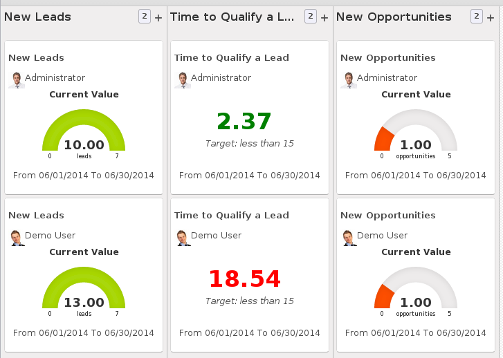
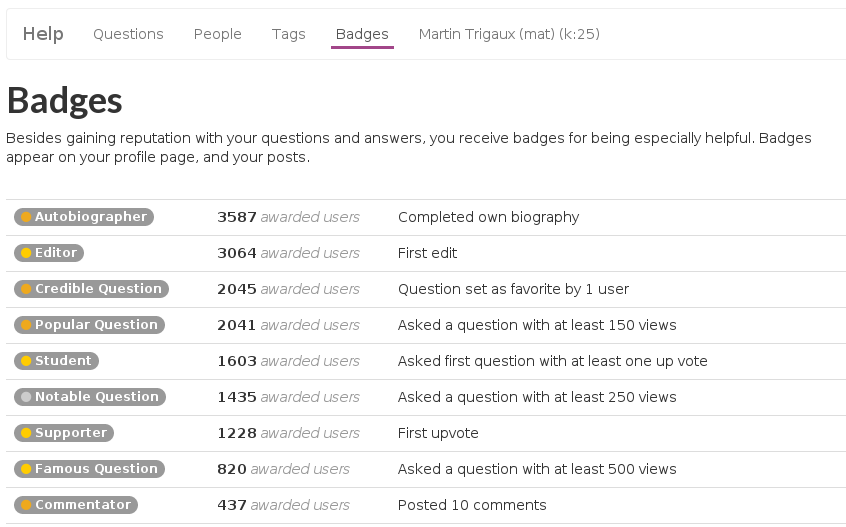
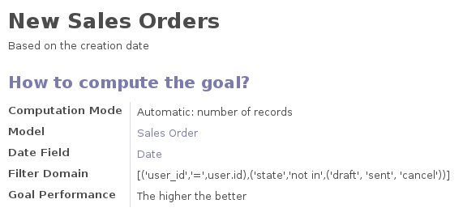

Drive engagement with gamification
==================================

Martin Trigaux, Developer

Table of content
----------------

.. image:: images/gamification_logo.png
   :align: right

1. Presentation
2. Challenge
3. Use case sales
4. Use case forum
5. Conclusion

Gamification
------------

*What is this all about?*

* evaluation
* motivation
* process

.. note::

	gamification = assign goals to people

	evaluation -> set targets and check team progress

	motivation -> fun, badges, encourage to use

	process -> check list, complete your profile,..

Challenge
---------

* **Who?**
	Who is participating? *groups or condition*

* **What?**
	What are the goals? *definition + target*

* **Why?**
	What is the reward? *badges*

.. note::

	gamification works with challenges

	participation -> list of users, based on domain

	goals -> definition + target

	reward -> badges, everybody or first

Use case 1: sales
-----------------

.. image:: images/lead_aquisition.png
   :align: center

.. note::

	show process with demo, explain options

Use case 1: sales
-----------------

Use case 2: forum
-----------------

.. image:: images/forum_users.png
   :align: center

.. note::

	example question commentator + badge

Use case 2: forum
-----------------

Conclusion
----------

* create rules for your own modules
* look at existing rules for inspiration

.. note::

	definition can be tricky, check exisiting

Thanks
======
Questions ?
