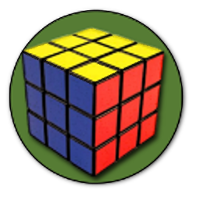
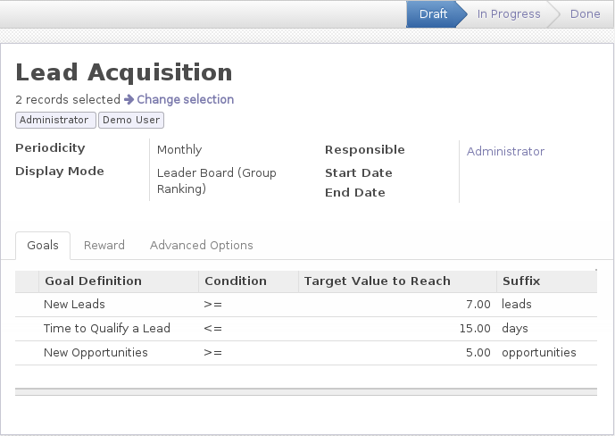
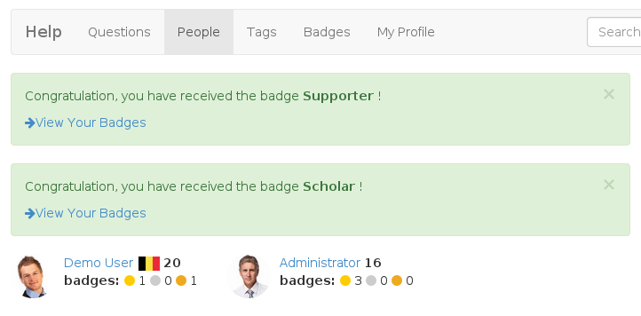

Use Gamification Module
=======================

Martin Trigaux, Developer

Gamification
------------

*What is this all about?*

* evaluation
* motivation
* process

.. note::

	gamification = assign goals to people

	evaluation -> set targets and check team progress

	motivation -> fun, badges, encourage to use

	process -> check list, complete your profile,..

Challenge
---------

* **Who?**
	Who is participating? *groups or condition*
* **What?**
	What are the goals? *definition + target*
* **Why?**
	What is the reward? *badges*

.. note::

	participation -> list of users, based on domain

	goals -> definition + target

	reward -> badges, everybody or first

Use case 1: sales
-----------------

.. note::

	show process with demo, explain options

Use case 2: forum
-----------------

.. note::

	example question commentator + badge

Thanks
======
Questions ?
