Smart Buttons in v8
===================

Géry Debongnie

Content
----------------
1. What are Smart Buttons?
2. From Regular Buttons to Smart Buttons
3. Magic! (not really)
4. Customizing the Look
5. Customizing the Content

What are Smart Buttons?
==========================

Smart Buttons
-------------

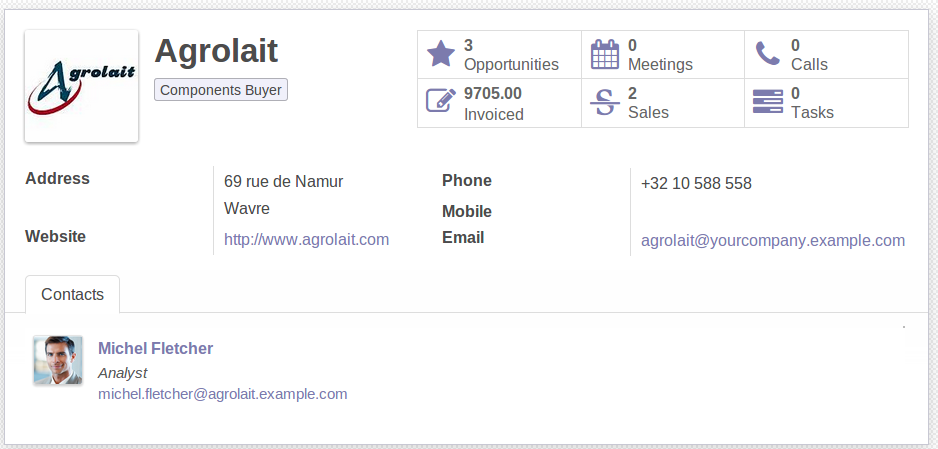

.. nextslide::
    :increment:

**From**

.. image:: images/oldstyle.png
    :align: center
    :width: 500px

**To**

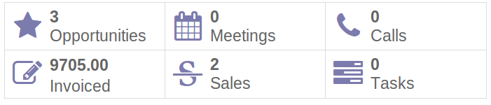

.. nextslide:: 
    :increment:

Two biggest advantages: 

* dynamic,
* customizable.

From Regular to Smart
=====================
it's not hard

Converting a plain button
-------------------------

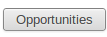

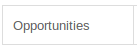

Before:

.. code-block:: xml

    <button class="oe_inline" type="action" 
        string="Opportunities"
        name="..." context="..."/>

After:

.. code-block:: xml

    <button class="oe_inline oe_stat_button" type="action" 
        string="Opportunities"
        name="..." context="..."/>

.. nextslide::
    :increment:

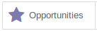

Just add 'icon' attribute.

.. code-block:: xml

    <button class="oe_inline oe_stat_button" type="action" 
        string="Opportunities"
        icon="fa-star"
        name="..." context="..."/>

Font awesome:

http://fortawesome.github.io/Font-Awesome/

Where is the magic?
===================
(next slide)

..

Button tag can contain anything
--------------------------------
Before, the button tag was self-closed:

.. code-block:: xml

    <button/> 

Now, it can contain literally anything:

.. code-block:: html

    <button>
        literally anything
    </button>

The form view parse the button and render anything inside (html/Odoo widgets)

Example (html)
---------------
Pure html : Full control on the content

.. code-block:: xml

    <button class="..." type="..." name="..." context="...">
        
Hello <strong>Odoo</strong>

    </button>

Result:

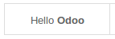

Example (html+field)
---------------------

.. code-block:: xml

    <button class="..." type="..." name="..." icon="fa-star">
        <field name="opportunity_count"/> Opportunities
    </button>

Result:

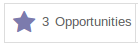

This is fully dynamic!

Common situation: One2many fields
----------------------------------

Example: *phonecall_ids* in res.partner. 

Step 1: add functional field *phonecall_count* to res.partner

Step 2: add field with widget 'statinfo'

.. code-block:: xml

    <button class="..." type="..." name="..." icon="..." context="...">
        <field string="Calls" name="phonecall_count" widget="statinfo"/>
    </button>

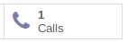

Customize your buttons
----------------------

We can customize in two ways:

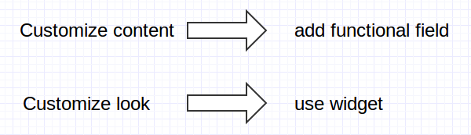

Customizing Content
=====================

Case study: Sum of all invoices for a customer
---------------------------------------------------------

1. add functional field

.. code-block:: python

    'total_invoiced': fields.function(_invoice_total, 
                                      string="Total Invoiced", 
                                      type='float')

.. code-block:: python

    def _invoice_total(self, cr, uid, ids, field_name, arg, context=None):
        result = {}
        account_invoice_report = self.pool.get('account.invoice.report')
        for partner in self.browse(cr, uid, ids, context=context):
            ...
        return result

.. nextslide::
   :increment:

2. add field to button

.. code-block:: xml

    <button type="action" class="oe_stat_button"
        icon="fa-pencil-square-o"  name="..." context="..." >
        <field name="total_invoiced" widget="statinfo"/>
    </button>

3. profit!

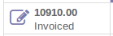

Customizing Look
===================

PercentPie Widget
-------------------

Percentage (integer between 0 and 100)

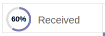

.. code-block:: xml

    <button name="..." type="action" class="oe_stat_button">
        <field name="received_ratio" 
               string="Received" 
               widget="percentpie"/>
    </button>

Bar Chart Widget
-----------------

Need to display some kind of trends? Use BarChart Widget!

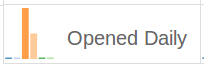

.. code-block:: xml

    <button name="..." type="action" class="oe_stat_button">
        <field name="opened_daily" 
               string="Opened Daily" 
               widget="barchart"/>
    </button>

(see mass_mailing.py for full details)

Thank you!
============
