OpenChatter Integration
=======================

Thibault Delavallée, R&D Engineer

Messaging, OpenChatter
----------------------

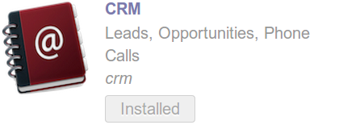

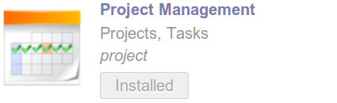

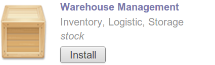

Transversal app

* Discuss with customers on quotations
* Feedback on issues
* Mailing groups
* Discussions on tasks
* Subscribe to Newsletters

.. nextslide::

Transversal features

* OpenChatter
* Comunication history
* Subscribe, Followers
* Action counters
* Mail gateway
* Aliases

OpenChatter / mail.thread
-------------------------

OpenChatter in your model::

    class MyClass(Model):
        _inherit = 'mail.thread'

OpenChatter in your view

.. code-block:: xml

   

     <field name="message_follower_ids" widget="mail_followers"/>
     <field name="message_ids" widget="mail_thread"/>
   

And you are done !

.. nextslide::

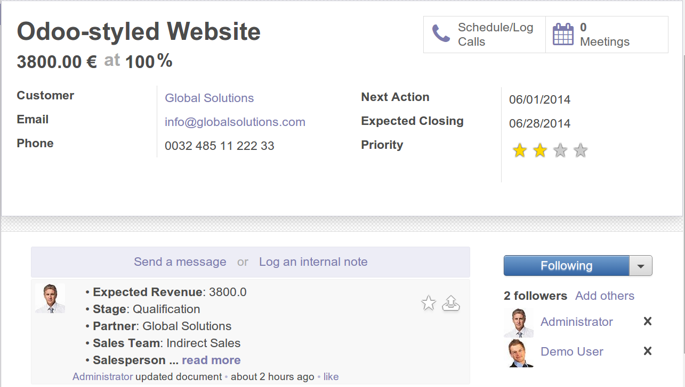

.. nextslide::

What did it do ? new fields, linking messaging models

.. code-block:: python

  _columns = {
    'message_ids': ... # communication history
    'message_follower_ids': ... # followers
    'message_unread': ... # unread messages
  }

  class MailMessage(Model):
    ...

  class MailMail(Model):
    ...

  class MailFollowers(Model):
    ...

.. nextslide::

What did it do ? new features

.. code-block:: python

  def message_post(...):

  def message_track(...):

  def message_subscribe(...):

  def message_process(...):

Subtypes
--------

Subscription customization

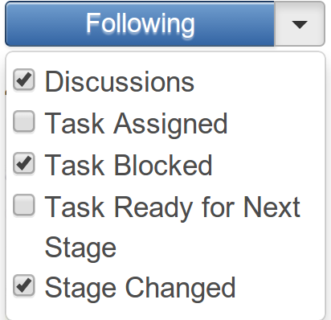

Automatic logging

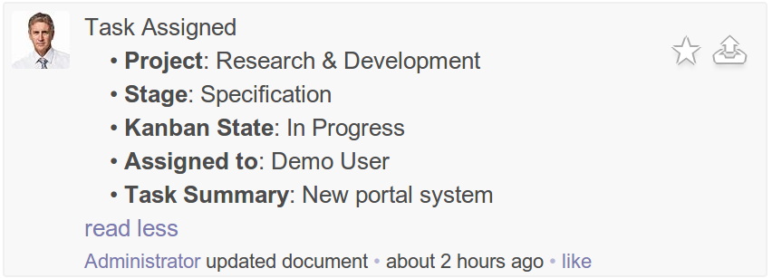

.. nextslide::

Define subtypes in XML

.. code-block:: xml

  <record id="mt_task_assigned" model="mail.message.subtype">
    <field name="name">Task Assigned</field>
    <field name="res_model">project.task</field>
    <field name="default" eval="False"/>
  </record>

.. nextslide::

Bind them to the model

.. code-block:: python

  _columns = {
    'user_id': fields.many2one('res.users',
                               track_visibility='onchange'),
  }

  _track = {
    'user_id': {
        'project.mt_task_assigned': lambda self, cr, uid, obj, c=None:
          obj.user_id and obj.user_id.id,
    }
  }

NeedAction
----------

NeedAction in your model::

    class MyClass(Model):
        _inherit = 'ir.needaction_mixin'

Define a standard `message_unread` search filter

.. code-block:: xml

   <filter string="Unread Messagingges"
           name="message_unread"
           domain="[('message_unread','=',True)]"
           help="Unread messages"/>

.. nextslide::

Action counters

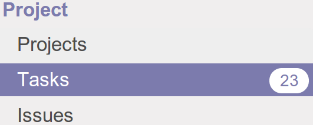

Kanban

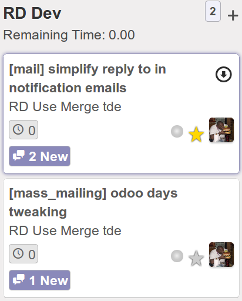

Email aliases
-------------

Add alias management in your model::

  class MyClass(Model):
    _inherits = {'mail.alias': 'alias_id'}

    _columns = {
      'alias_id': fields.many2one('mail.alias', 'Alias'),
    }

New record -> new alias

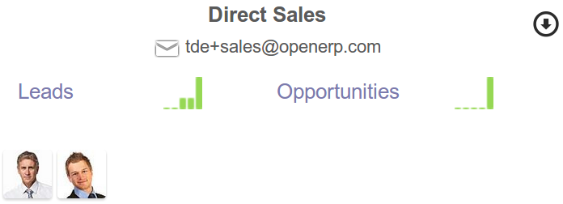

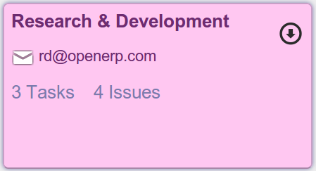

Aliases and Mail Gateway
------------------------

* `alias_contact` -> privacy settings
* `alias_force_thread_id` -> redirect emails to a document's thread or create a new document

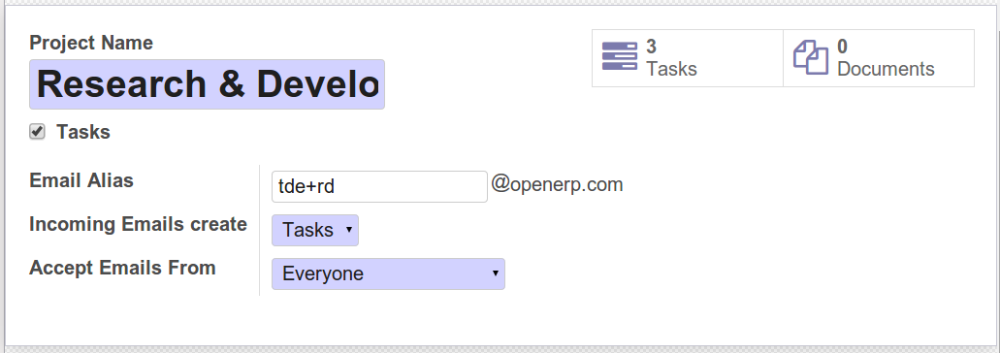

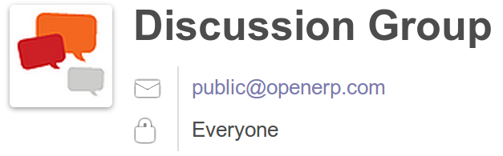

Summary
-------

* Customization through subtypes, tracking
* Action counter
* Mail gateway and aliases integration
* -> inheritance (python)
* -> light model decoration
* -> a bit of subtypes / aliases (XML)
* *Play with it !*

Thanks for your attention
=========================

Questions ? tde@openerp.com