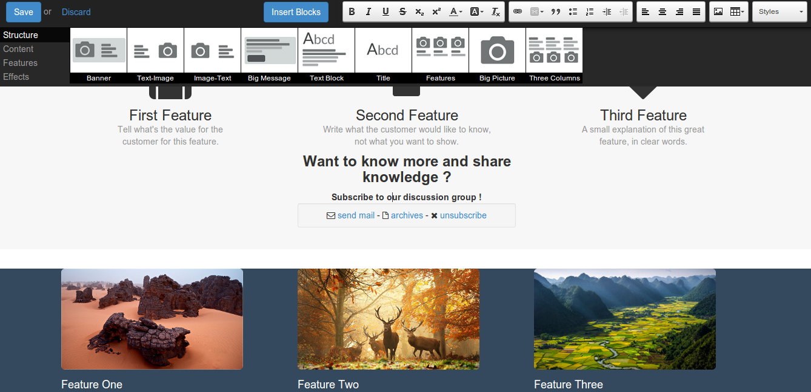
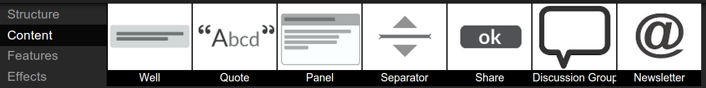
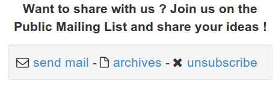
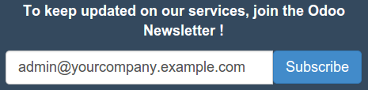
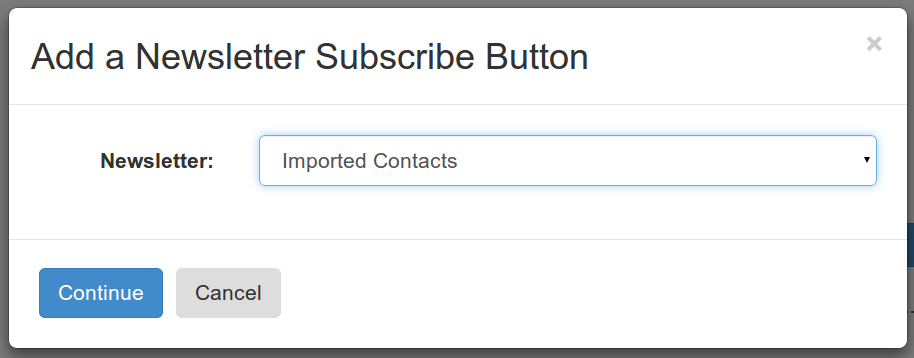
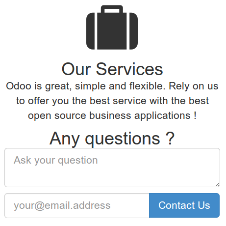
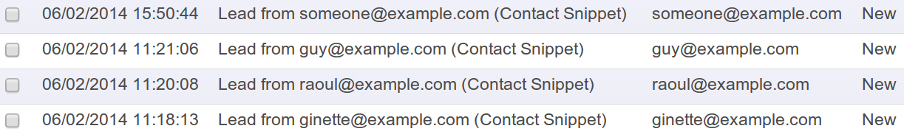
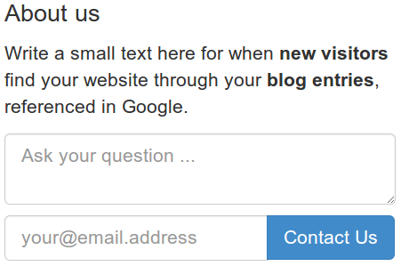
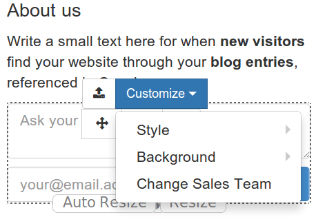
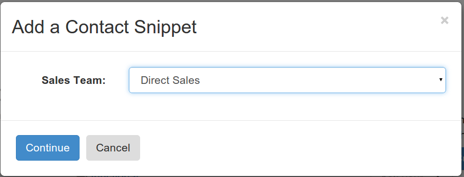

CMS Dynamic Widgets
===================

Thibault Delavallée, R&D Engineer

Dynamic widgets
---------------

.. nextslide::

Widgets, Snippets -> CMS building blocks

Dynamic widgets: Discussion Groups, Mailing Lists

.. nextslide::

* Efficient and simple way to customize your website
* Integrates with Odoo apps: subscribe to a discussion group, create leads, fill issues, ...
* Use the full power of odoo

Show me the stuff !
-------------------

Running example: **Contact Widget**

* small contact form
* create leads from questions
* drag 'n drop it anywhere usefull

Demo
====

Talk structure
--------------

Running example: Contact Widget

* body, content
* addition in CMS editor
* dynamic configuration: choosing the sales team
* link with backend: linking the button to the lead creation

Body: widget content
---------------------

Body = **HTML** + **CSS** (bootstrap)

* a (hidden) sales team
* a question
* an email
* a submit button

.. code-block:: xml

  <input type="hidden" name="section_id" value="0"/>
  <textarea name="description"></textarea>
  

    <input type="email" name="email_from"/>
    <button type="submit">Contact Us</button>
  

Addition in Editor
------------------

Snippets ? QWeb template !

.. code-block:: xml

  <?xml version="1.0" encoding="utf-8"?>
  <openerp>
  <data>
    <template id="snippets">
    <!-- here be snippets by categories -->
    ...
    </template>
  </data>
  </openerp>

.. nextslide::

Snippet addition: extend the editor QWeb template

.. code-block:: xml

  <template id="contact_snippet"
            name="Contact Snippet"
            inherit_id="website.snippets">
    <xpath expr="//div[@id='snippet_feature']" position="inside">
      <!-- begin snippet declaration -->
      

        ...
      

      <!-- end of snippet declaration -->
    </xpath>
  </template>

.. nextslide::

* thumbnail: icon in editor

.. code-block:: xml

  <xpath expr="//div[@id='snippet_feature']" position="inside">
    

      
      Contact Snippet
    

  </xpath>

* body of the snippet

.. code-block:: xml

  <xpath expr="//div[@id='snippet_feature']" position="inside">
    <section class="oe_snippet_body js_contact">
      <!-- snippet HTML content -->
    </section>
  </xpath>

Snippet options
---------------

* placement: `data-selector-...`
* menu option: `li`, option menu entry

.. code-block:: xml

  

    <li>
      <a href="#" class="button js_contact_sales_team">
        Change Sales Team
      </a>
    </li>
  

Widget -> Dynamic Widget
========================

Dynamic customize
-----------------

Customize menu

To link with

.. nextslide::

Add a `snippet.Option` to add dynamic configuration

Example: `Discussion Group` choice, `Sales Team` choice, ...

.. code-block:: javascript

  snippet.options.contact_snippet = snippet.Option.extend({

    on_prompt: function () {
      return website.prompt({
        window_title: _t("Add a Contact Snippet"),
        init: function (field) {
          return website.session.model('crm.case.section')
                  .call('name_search', ['', []])},
      }).then(function (sales_team_id) {
        self.$('.js_section_id').attr("value", sales_team_id);
      });
    }
  });

Link with back-end
------------------

To contact the back-end: define a new **route**

* Route: URL -> action performed by server
* Defined in Python, in a controller

.. code-block:: python

  class ContactUsShort(http.Controller):
    # define my custom controller
    @http.route('/my/route', ...)
    def my_route(...):

`{http://myodoo.com/}crm/contact_short` will be a route creating a lead from data coming from the form

.. nextslide::

`crm/contact_short` definition

.. code-block:: python

  @http.route(['/crm/contact_short'], type='json')
  def contactus(self, question=None, email=None,
                section_id=None, **kwargs):
    lead_values = {
      'name': 'Lead from %s (Contact Snippet)' % email,
      'description': question,
      'email_from': email,
      'section_id': section_id,
      'user_id': False,
    }
    return request.registry['crm.lead'].create(cr, uid, lead_values,
                                               context)

Dynamic behavior
----------------

Bind `Contact Us` to the back-end

.. code-block:: javascript

  snippet.animationRegistry.contact = snippet.Animation.extend({
    start: function (editable_mode) {
      this.$('.js_contact_btn').on('click', function (event) {
        // perform verification
        ...
        // json call to a route
        return openerp.jsonRpc('/crm/contact_short', 'call', {
            'section_id': +section_id,
            'email': email,
            'question': question,
        }).then(function (result) { ... });
      });
    },
  });

And we are done !
-----------------

* Definition: an HTML body in a template
* Placement: XML declaration
* Configuration: JS Option
* Behavior: JS Animation
* Link: Python controller and routes

Thanks for your attention
=========================

Any questions ? tde@odoo.com / chm@odoo.com
