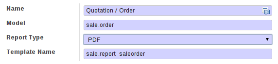
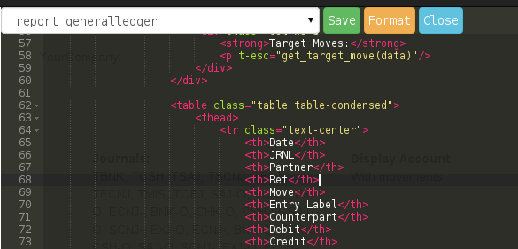
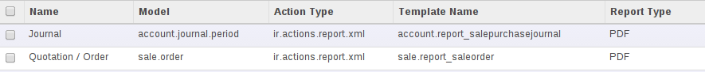
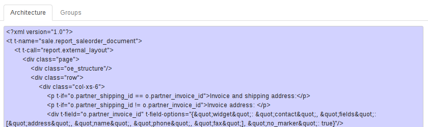
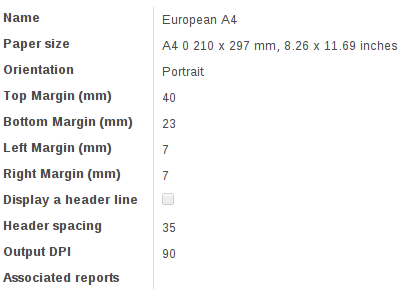
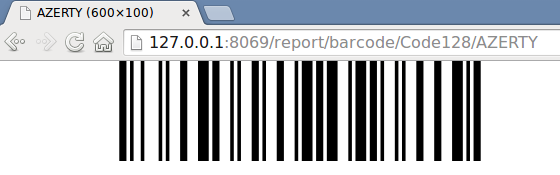

Reporting Engine in v8
======================

Table of content 1/2
---------------------
**Functional overview**

* How to..
    * Customize an existing report
    * Change its paper format
    * Add barcodes

* Minimal template
* Design informations
* Reports are web pages

Table of content 2/2
---------------------
**Technical overview**

* Paper Format and Report declaration
* Structure of the module
* Generic / particular report
* Used technologies
* Future enhancements

Functional
===========

A few things before starting
----------------------------
* Reports are written in HTML/QWeb, just like any page of the Odoo Website, thus **the website editor is available**.
* You are customizing **the template** of the report, thus it affects **all reports**, not only the selected one.
* The PDF rendering is done by a tool outside the Odoo framework, **Wkhtmltopdf**.
* All Odoo Addons are converted to QWeb

Customize an existing report
=============================

Customize an existing report
----------------------------
* First way: Online HTML Editor
    * User in website publisher group
    * Change type of report from PDF to HTML

Customize an existing report
----------------------------
* Second way: ir.ui.view form
    * **Technical settings** then **Reports** menu in settings

Change its paper format
=======================

Change its paper format
----------------------------
* **Technical settings** then **Paper format** under Reports menu in settings

* Default paper format on the company
* You can define a paper format on a report record

Add barcodes
============

Add barcodes
------------
* Barcodes are images returned by a controller
* Quite easy thanks to the Qweb syntax

.. code-block:: html

    

* More parameters can be passed as a query string

.. code-block:: html

    

Minimal template
================

Minimal template
----------------

.. code-block:: xml

    <t t-call="report.html_container">
        <t t-foreach="docs" t-as="o">
            <t t-call="report.external_layout">
                

                    <h2>Report title</h2>
                

            </t>
        </t>
    </t>

* Calling **external_layout** will add the default header and footer
* PDF body will be the content inside 

Design informations
-------------------
* If you use twitter bootstrap to design your report, use col-xs column
* Local CSS can be put directly in the template
* Global CSS can be put in the report.style template
* Two layouts (defining header/footer) are installed by default but you of course can create your own   
* If you don't want header/footer, don't put a div node with a header/footer class

Reports are web pages
=====================

Reports are web pages
---------------------
* Thus, accessible by an URL

Sale Order in the html mode

.. code-block:: html

    [...]/report/html/sale.report_saleorder/38

You want it in pdf ?

.. code-block:: html

    [...]/report/pdf/sale.report_saleorder/38

Technical
==========

Paper Format and Report declaration
===================================

Declare a report
----------------
**Every report must have an ir.actions.report.xml record**

.. code-block:: xml

    <report 
        id="account_invoices"
        model="account.invoice"
        string="Invoices"
        report_type="qweb-pdf"
        name="account.report_invoice"
        file="account.report_invoice"
        attachment_use="True"
        attachment="(object.state in ('open','paid')) and
            ('INV'+(object.number or '').replace('/','')+'.pdf')"
    />

Declare a paper format
----------------------

.. code-block:: xml

    <record id="paperformat_frenchcheck" model="report.paperformat">
        <field name="name">French Bank Check</field>
        <field name="default" eval="True"/>
        <field name="format">custom</field>
        <field name="page_height">80</field>
        <field name="page_width">175</field>
        <field name="orientation">Portrait</field>
        <field name="margin_top">3</field>
        <field name="margin_bottom">3</field>
        <field name="margin_left">3</field>
        <field name="margin_right">3</field>
        <field name="header_line" eval="False"/>
        <field name="header_spacing">3</field>
        <field name="dpi">80</field>
    </record>

Declare a paper format
----------------------

You have now everything to create reports !

* A template (ir.ui.view record)
* A report record (ir.actions.report.xml record)
* And maybe a specific paper format (report.paperformat record)

**Most reports do not need more**

Structure of the module
=======================

Structure of the module
-----------------------
* The controllers behind the report's URL are just interface to classic odoo API methods on a model named Report.

.. code-block:: python

    @route([
        '/report/<path:converter>/<reportname>',
        '/report/<path:converter>/<reportname>/<docids>',
    ], [...])
    def report_routes([...]):
        report_obj = request.registry['report']
        cr, uid, context = request.cr, request.uid, request.context
        [...]
        if converter == 'html':
            html = report_obj.get_html(
                cr, uid, docids, reportname,
                data=options_data, context=context
            )
            return request.make_response(html)

Structure of the module
-----------------------
This report model has three main methods:

* get_html
* get_pdf
* get_action

get_html will look for a model named **report.<<report_name>>**. If it exists, then get_html
returns **report.<<report_name>>**.render_html(). If not, get_html will use a generic render_html.

It is the difference between a generic and a particular report.

Generic / particular report
===========================

Generic / particular report
---------------------------
* **Generic**
    * Default rendering context (*docs*, *translate_doc*, ...)
* **Particular**
    * New rendering context containing anything you want to process your data
    * Odoo AbstractModel, custom module needed

For a particular report, you have to write an Odoo Model containing a render_html method. Classically, this 
method returns a call to the original **QWeb render** with a **custom rendering context**. 

Writing a particular report
---------------------------

.. code-block:: python

    from openerp.osv import osv

    class ParticularReport(osv.AbstractModel):
        _name = 'report.<<module.reportname>>'
        def render_html(self, cr, uid, ids, data=None, context=None):
            report_obj = self.pool['report']
            report = report_obj._get_report_from_name(
                cr, uid, '<<module.reportname>>'
            )
            docargs = {
                'doc_ids': ids,
                'doc_model': report.model,
                'docs': self.pool[report.model].browse(
                    cr, uid, ids, context=context
                ),
            }
            return report_obj.render(
                cr, uid, ids, '<<module.reportname>>',
                docargs, context=context
            )

Used technologies
=================

Used technologies
-----------------
* The templating engine is **QWeb** (server-side rendering)

* The barcodes images are rendered by **Reportlab**
    * http://www.reportlab.com
    * Please use at least 3.0
    * Don't forget the fonts http://www.reportlab.com/ftp/pfbfer.zip

Used technologies
-----------------
* The PDF rendering is done by **Wkhtmltopdf**
    * http://wkhtmltopdf.org/
    * https://github.com/wkhtmltopdf
    * Please use at least 0.12.0
* Report module can be adapted to competitors like **PhantomJS**, **SlimerJS**, **Weasyprint**, etc.
* Advantages of **Wkhtmltopdf**
    * Recent versions support table split accross pages
    * Nice API for paper format

Future enhancements
===================

Future enhancements
-------------------
* Create report-dedicated Website Builder snippets
* Table edition in the Website Builder RTE
* Set a larger viewport on the PDF rendering engine (currently 800*600, wkhtmltopdf settings [1]).
* When using translate_doc on a template, display it the view in the html editor

[1] https://github.com/wkhtmltopdf/wkhtmltopdf/issues/1508

Thanks for your listening
==========================
sle@odoo.com
